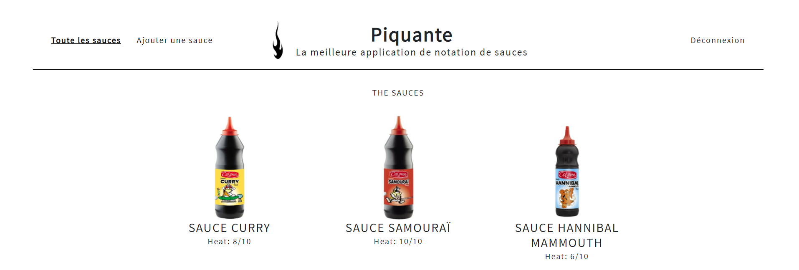

<h1 align= "center" >So Pekocko - Projet 6 OC</h1>

<p align= "center">

L'application So Pekocko est une application web permettant aux utilisateurs d’ajouter leurs sauces préférées en donnant une note et de liker ou disliker les sauces ajoutées par les autres utilisateurs.  

<details open="open">
  <summary>Sommaire</summary>
  <ol>
    <li>
      <a href="#demarrage">Démarrage</a>
      <ul>
        <li><a href="#prerequis">Prérequis</a></li>
        <li><a href="#installation">Installation</a></li>
      </ul>
    </li>
    </li>
        <li>
      <a href="#apropos">A propos du Site</a>
      <ul>
        <li><a href="#outils">Outils utilisés</a></li>
        <li><a href="#doc">Documentation</a></li>
      </ul>
    </li>
    <li><a href="#dependence">Dépendences NPM</li> 
    <li><a href="#contact">Contact</a></li>
  </ol>
</details>

<h2 id="demarrage" align="center">Démarrage</h2>

<h3 id="prerequis">Prérequis</h3>

<p>Avant toute chose, il faut cloner le projet via GitHub vers le dossier de votre choix :</p>

```sh
git clone https://github.com/Sheleril/So-Pekocko.git
```
:warning: Attention, pour que votre site fonctionne et que la connexion à la base de donnée puisse se faire, il faut crée un fichier dans votre dossier Backend.
L'appeler `.env` , et suivre la structure qui suit :

```js
TOKEN_SECRET_KEY=TokenSecretKey

DB_CLUSTER=ClusterName
DB_USER=UserName
DB_PASS=Password
```

Ceci est une sécurité pour la base de donnée, si vous souhaitez y accéder, je vous laisse [cliquer ici](mailto:sheleril68@gmail.com) pour me demander les variables *tokenSecretKey*, *ClusterName* et *Password* :smiley:


<h3 id="installation">Installation</h3>


<h4 align="center">Côté Frontend</h4>


Ciblez le Frontend avec votre terminal

```sh
cd frontend
```

Installez NPM

```sh
npm install
```
Lancez le serveur Frontend

```sh
ng serve
```

:warning: Pensez à garder ce terminal ouvert :warning:  

<h4 align="center">Côté Backend</h4>


Dans un second terminal, ciblez le backend
```sh
cd backend
```

Installez NPM
```sh
npm install
```

Puis, pour finir, tapez dans le terminal
```sh
nodemon server
```

:warning: Pensez à garder ce terminal ouvert :warning: 

Enfin, pour lancer le site vous pouvez cliquer si dessous:   
http://localhost:4200/login :bowtie:  

<p  align="center" ></p>

<h2 align="center" id="apropos"> A propos du site </h2>


<h3 id="outils">Outils utilisés &#x1F6E0; </h3>

* [Node.js](https://nodejs.org/en/blog/release/v14.15.1/)  (version 14.15.1)
* [Angular](https://github.com/angular/angular-cli) (version 7.0.2)
* [MongoDB Atlas](https://www.mongodb.com/try) Base de donnée

<h3 id="doc">Documentation &#x1F4CB;</h3>

* [Cahier des charges](img_readme/Guidelines+API.pdf)
* [Note de cadrage](img_readme/Cadrage.pdf)

<h2 id="dependence" align="center">Dépendences NPM</h2>


| Dépendance | Description | Documentation |   
|---|---|---|
|Express|Express est un Framework qui fournit un ensemble robuste de fonctionnalités pour développer des applications Web et mobiles | [Express](https://www.npmjs.com/package/express)|  
|Helmet|Helmet vous aide à sécuriser vos applications Express en définissant divers en-têtes HTTP.| [Helmet](https://www.npmjs.com/package/helmet)|
|Bcrypt| Bcrypt vous permet de crypter vos mots de passe. | [bcrypt](https://www.npmjs.com/package/bcrypt)|
|Body-Parser|Parse des données JSON.|[Body-Parser](https://www.npmjs.com/package/body-parser)|
Dotenv|Dotenv est un module sans dépendance qui charge les variables d'environnement d'un fichier .env dans process.env. Utile pour cacher les données d'accès MD. | [Dotenv](https://www.npmjs.com/package/dotenv)|
|Jsonwebtoken|Création de Token. | [JsonWebToken](https://www.npmjs.com/package/jsonwebtoken)|
|Mongoose|Mongoose est un outil de modélisation d'objets MongoDB.| [Mongoose](https://www.npmjs.com/package/mongoose) |
|Mongoose-Unique-Validator|Validation de champs unique d'un Schéma Mongoose. | [Mongoose-Unique-Validator](https://www.npmjs.com/package/mongoose-unique-validator)|
|Multer| Multer est utilisé principalement pour télécharger des fichiers.|[Multer](https://www.npmjs.com/package/multer)|

<h2 align="center">Contact</h2>

:e-mail: [Emmanuelle](mailto:sheleril68@gmail.com) :e-mail:

:heavy_plus_sign: [Github](https://github.com/Sheleril)


